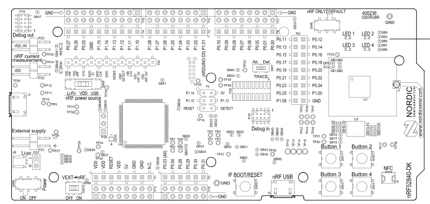

# Code

This folder will hold the code to the NRF52840.

All documentation on the device being used will be found here

[NRF52840DK Product Page](https://www.nordicsemi.com/Products/Development-hardware/nRF52840-DK)

[NRF52840 Documentation](https://infocenter.nordicsemi.com/index.jsp?topic=%2Fug_nrf52840_dk%2FUG%2Fcommon%2Fnordic_tools.html&anchor=nordic_tools)

[NRF Connect Samples](https://developer.nordicsemi.com/nRF_Connect_SDK/doc/latest/nrf/samples/bluetooth/peripheral_uart/README.html)

## Goal

To connect all devices using SPI/SDA and provide information back to laptop server.

### Prerequisites and Installation

1. Follow the NRF Getting started page [NRF Software Getting Started](https://infocenter.nordicsemi.com/index.jsp?topic=%2Fsdk_nrf5_v17.0.2%2Fgetting_started_precompiled.html)

- This will include downloading the SDK and Toolkit for NRF5 devices
- It is suggested to try to follow most steps using the "NRF Connect" plugin on VSCode to run the Blinky example
  - VSCode will handle builing, erasing, and flashing the board with new code making it easier rather than using one of the IDE's suggested by Nordic.

2. Clone the repo
   ```sh
   git clone https://github.com/Jdiazcaminos/HOOF-IMU.git
   ```

### Usage

If you would like to learn how most of the project works, the following code samples are perfect:

- [Bluetooth example](https://github.com/nrfconnect/sdk-nrf/tree/main/samples/bluetooth/peripheral_lbs)
  - This is good for a basic example of how bluetooth can be programmed
- [I2C Example](https://github.com/nrfconnect/sdk-zephyr/tree/v3.5.99-ncs1/samples/sensor/sht3xd/)
  - This is good for programming I2C capability with sensors.

Together these two examples can show how to send data from our I2C sensors through bluetooth to later process.

### Hardware Pinouts



This folder contains the code of both the peripheral/server devices and the central/client device.
